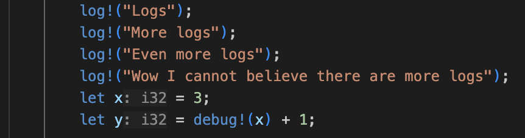

# Rust Advent of Code Template 🎄
<p align="center">
  
  
</p>

## CLI
Choose which day you want to run
```shell
cargo run <day-num>
```


## Yule Logger
`log!` macro so your `println!`s are more festive. `debug!` provided as an alternative for [`dbg!`](https://doc.rust-lang.org/std/macro.dbg.html)



## Panic Handling
Do not get on the naughtly list

